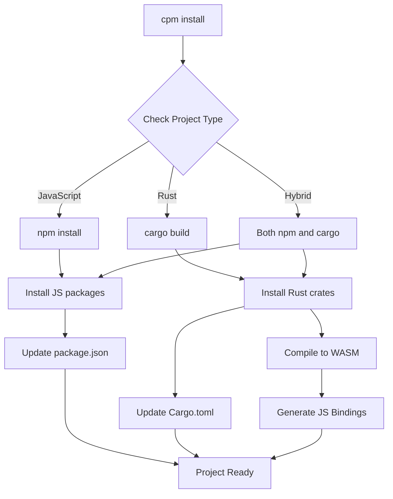
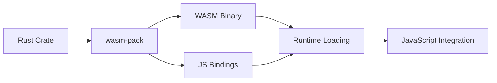

# CPM - Crab Package Manager

## Overview

CPM (Crab Package Manager) is a lightweight and intelligent wrapper for npm and cargo, providing unified dependency management for both JavaScript and Rust packages. It serves as a simple package manager that delegates to proven tools while providing a unified interface.

## Features

- **Unified Package Management**: Install JavaScript and Rust packages seamlessly
- **WebAssembly Integration**: Automatic compilation of Rust code to WASM
- **Intelligent Wrapper**: Delegates to npm and cargo for proven reliability
- **JavaScript-First**: Optimized for JavaScript projects with optional Rust
- **Cross-Platform**: Works on Windows, macOS, and Linux
- **Simple Interface**: Easy-to-use commands for common tasks
- **Development Tools**: Built-in dev, build, test, and npx support

## Installation

CPM can be installed via Cargo:

```bash
# Install CPM
cargo install cpm

# Or build from source
git clone https://github.com/JetCrabCollab/cpm.git
cd cpm
cargo build --release

# Verify CPM installation
cpm --version

# Expected output: CPM v0.4.0
```

## Quick Start

### Initialize a New Project
```bash
# Create a new JavaScript project
cpm init my-project -y
cd my-project

# This creates:
# - package.json (with CPM scripts)
# - index.js (main entry point)
# - README.md (project documentation)
```

### Install Dependencies
```bash
# Install JavaScript dependencies
cpm install

# Add Rust to existing project
cpm add-rust -y
```

### Run Development Server
```bash
# Start development server (JetCrab first, then Node.js)
cpm dev

# Build project
cpm build

# Run tests
cpm test
```

## Commands Reference

### Package Management
| Command | Description | Example |
|---------|-------------|---------|
| `cpm install` | Install dependencies (npm + cargo) | `cpm install` |
| `cpm build` | Build the project | `cpm build` |

### Project Management
| Command | Description | Example |
|---------|-------------|---------|
| `cpm init [name] [-y]` | Initialize a new JavaScript project | `cpm init my-app -y` |
| `cpm add-rust [-y]` | Add Rust to existing project | `cpm add-rust -y` |
| `cpm remove-rust [-y]` | Remove Rust from project | `cpm remove-rust -y` |
| `cpm rust-status` | Check Rust status | `cpm rust-status` |

### Development Tools
| Command | Description | Example |
|---------|-------------|---------|
| `cpm dev` | Start development server | `cpm dev` |
| `cpm test` | Run tests (npm + cargo) | `cpm test` |
| `cpm npx <package> [args...]` | Execute packages with npx | `cpm npx create-react-app my-app` |

## Configuration

### Package Configuration (package.json)
```json
{
  "name": "my-project",
  "version": "1.0.0",
  "description": "My CPM project",
  "main": "index.js",
  "scripts": {
    "build": "cpm build",
    "dev": "cpm dev",
    "test": "cpm test"
  },
  "dependencies": {
    "react": "^18.0.0",
    "lodash": "^4.17.21"
  },
  "devDependencies": {
    "jest": "^29.0.0"
  }
}
```

### Rust Configuration (Cargo.toml)
```toml
[package]
name = "my-project"
version = "0.1.0"
edition = "2021"

[lib]
crate-type = ["cdylib"]

[dependencies]
wasm-bindgen = "0.2"
web-sys = "0.3"
```

## Architecture

### Package Resolution Flow


### WebAssembly Integration


## Advanced Features

### Hybrid Packages
Packages that combine JavaScript and Rust:

```json
{
  "name": "my-hybrid-package",
  "version": "0.4.0",
  "main": "src/index.js",
  "wasm_entry": "src/lib.rs",
  "dependencies": {
    "lodash": "^4.17.21"
  },
  "rust_dependencies": {
    "serde": "1.0"
  }
}
```

### Custom Registries
```bash
# Add custom registry
# Registry management not yet implemented

# Install from custom registry
cpm install @my-registry/package
```

### Workspace Support
```json
{
  "workspaces": [
    "packages/*",
    "apps/*"
  ]
}
```

## Development Workflow

### 1. Project Setup
```bash
# Initialize project
cpm init my-project
cd my-project

# Install dependencies
cpm install react serde
```

### 2. Development
```bash
# Start development server
cpm dev

# In another terminal, run tests
cpm test

# Lint code
cpm lint
```

### 3. Building
```bash
# Create production bundle
cpm bundle

# Build optimized version
cargo build --release
```

## Performance Optimization

### Caching Strategy
- **Package Cache**: Downloaded packages cached locally
- **Build Cache**: Compilation results cached
- **Dependency Cache**: Dependency trees cached
- **Registry Cache**: Registry responses cached

### Build Performance
- Parallel dependency resolution
- Incremental compilation
- Intelligent caching
- Optimized WebAssembly generation

## Security Features

### Package Verification
- Package integrity checking
- Digital signature verification
- Dependency vulnerability scanning
- Secure registry communication

### Sandboxing
- Isolated package execution
- Resource limits
- Network access control
- File system restrictions

## Troubleshooting

### Common Issues

#### Package Installation Fails
```bash
# Clear cache and retry
cpm cache clear
cpm install [package]
```

#### WebAssembly Compilation Errors
```bash
# Check Rust toolchain
rustup show

# Update wasm-pack
cargo install wasm-pack --force
```

#### Registry Connection Issues
```bash
# Check registry configuration
# Registry commands not yet implemented

# Test connectivity
# Registry commands not yet implemented
```

### Debug Mode
```bash
# Enable verbose logging
cpm --verbose install [package]

# Debug specific command
RUST_LOG=debug cpm install react
```

## Best Practices

### 1. Project Organization
```
my-project/
├── src/
│   ├── index.js          # Main entry point
│   └── lib.rs           # Rust library (optional)
├── tests/
│   └── test.js          # Test files
├── package.json            # Package configuration
└── README.md            # Project documentation
```

### 2. Dependency Management
- Use exact versions for production dependencies
- Keep development dependencies separate
- Regularly update dependencies
- Use lock files for reproducible builds

### 3. Performance
- Leverage caching for faster builds
- Use incremental compilation
- Optimize WebAssembly bundle size
- Profile build performance regularly

## Integration with JetCrab

### Runtime Integration
```javascript
// Claw automatically configures JetCrab runtime
// No additional setup required

// JavaScript code can import packages
import { debounce } from 'lodash';
import { add } from './pkg/my_rust_lib.js';

console.log(debounce(() => console.log('Hello'), 100));
console.log(add(2, 3));
```

### Development Integration
```bash
# Claw validates JetCrab installation
cpm install react  # Automatically checks JetCrab

# Skip validation if needed
cpm --skip-jetcrab-check install react
```

## Examples

### Basic JavaScript Project
```bash
# Initialize project
cpm init js-project
cd js-project

# Install dependencies
cpm install lodash axios

# Create main file
echo "import _ from 'lodash'; console.log(_.chunk([1,2,3,4], 2));" > src/index.js

# Run project
cpm run start
```

### Hybrid JavaScript + Rust Project
```bash
# Initialize project
cpm init hybrid-project
cd hybrid-project

# Install both JS and Rust dependencies
cpm install react serde

# Create Rust library
echo 'use serde::{Serialize, Deserialize}; #[derive(Serialize, Deserialize)] pub struct User { pub name: String, pub age: u32 }' > src/lib.rs

# Create JavaScript entry
echo "import { User } from './pkg/hybrid_project.js'; const user = new User('Alice', 30); console.log(user);" > src/index.js

# Run project
cpm run start
```

## Resources

- **Documentation**: [docs/](../README.md)
- **Examples**: [examples/](../../examples/)
- **GitHub Repository**: [JetCrab](https://github.com/JetCrabCollab/JetCrab)
- **Issues**: [GitHub Issues](https://github.com/JetCrabCollab/JetCrab/issues)
- **Discussions**: [GitHub Discussions](https://github.com/JetCrabCollab/JetCrab/discussions)

---

**CPM v0.4.0** - Crab Package Manager for JavaScript and Rust
